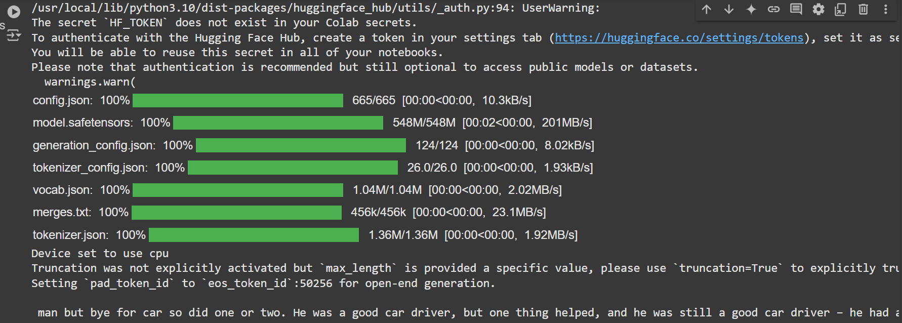
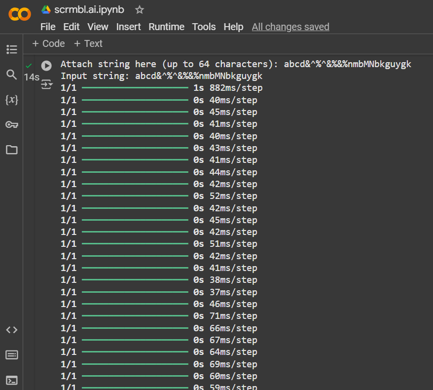
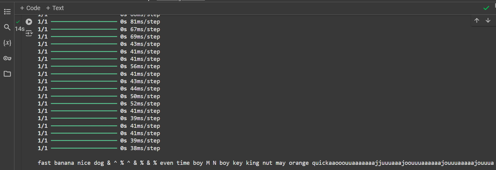

# scrambl
intake string, embed string in a word from word_list.  
create random order sentence from results. 
add conjunction.  
vs - scrambl regular random output  
vs - touchy torchy facilitating torch    
vs - intense tensor facilitating tensorFlow  
  
  
  

